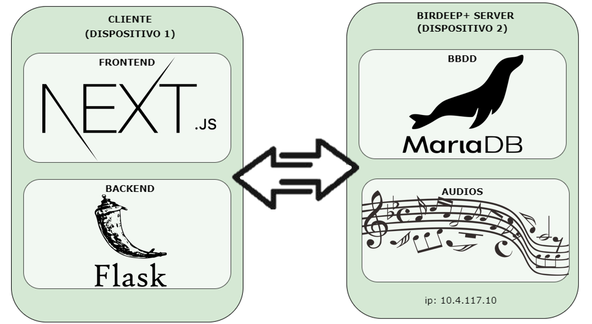

# README

## Descripción

**Birdeep** es un proyecto que comenzó como una colaboración entre el **Doñana (CSIC)** y la **U-TAD**, con el objetivo de monitorizar la avifauna del parque mediante el análisis de su canto. Para ello, se ha implementado una inteligencia artificial capaz de detectar y clasificar las aves.
 
Gracias a este sistema, es posible determinar tanto las épocas de migración de las aves en España como los efectos del cambio climático en las especies de la zona.

**Birdeep+**, desarrollado por un grupo de alumnos de la U-TAD en el **Project Center**, surge con la intención de hacer accesible el proyecto al público. Hasta ahora, todos los audios analizados, la IA desarrollada y las conclusiones alcanzadas no estaban disponibles fuera de la organización. Con **Birdeep+**, se busca ofrecer acceso global a todas las grabaciones almacenadas, permitiendo su escucha y descarga, además de proporcionar análisis en tiempo real a traves de la IA para la detección de especies en las grabaciones.

Además de esto, se busca desarrollar una versión más profesional de las grabadoras. Actualmente, estas se encuentran a la intemperie, con una señal de red débil, en un entorno húmedo y con temperaturas muy variables, lo que provoca frecuentes fallos en su funcionamiento. Para abordar este problema, se están desarrollando grabadoras similares dentro del **Project Center** y sus alrededores, con el fin de simular las condiciones adversas y determinar las causas de las fallas experimentadas por los dispositivos ubicados en Doñana.

## Como ejecutar

### Clonar la raiz del proyecto

```cpp
https://github.com/birdeeplus/birdeep.git
```

### Frontend

```cpp
//En la raiz ejecutamos los siguiente comandos
cd frontend
//descargamos las dependecias
npm install
//corremos el frontend
npm run dev
```

### Backend

```cpp
//creo el entorno en la raiz del entorno
python -m venv nombre_del_entorno
//ejecuto el entorno (linux)
source venv/bin/activate
//ejecuto el entorno (windows)
.\.venv\Scripts\activate
//en el backend ejecutamos el backend
cd backend
python app.py
//instalamos las dependecias
pip install -r requirements.txt

```

### Base de datos (en el servidor)

```cpp
//creamos la base de datos por medio del bump
mariadb -u root -p birdeep < "dump_db.sql"
//creamos el usario (nombre: birdeep_user, password: clave
mariadb -u root -p
USE birdeep
CREATE USER 'birdeep_user'@'localhost' IDENTIFIED BY 'clave'; 
GRANT ALL PRIVILEGES ON birdeep.* TO 'birdeep_user'@'localhost';
FLUSH PRIVILEGES;
EXIT;
```

### Para acceso a descarga y reproducción (en el servidor)

```cpp
//en la raiz de los ficheros (la carpeta que contiene el datos audio)
python3 -m http.server 8081
```

### Ajustar la conexión a la base de datos (crear 2 .env)

```python
# Dentro de la carpeta frontend
NEXT_PUBLIC_DB_HOST=10.4.117.10                         #cambiar por el ip del servidor de la base de datos
```

```python
# En la raiz del proyecto
# Base de datos
DB_USER=birdeep_user
DB_PASSWORD=clave
DB_HOST=10.4.117.10                         #cambiar por el ip del servidor de la base de datos (ip server birdeep+: 10.4.117.10)
DB_PORT=3306
DB_NAME=birdeep

# Inicio de sesion
JWT_USER=BirdeepAdmin
JWT_PASSWORD=password123
```

## Tecnologias usadas

- Backend: flask
- Frontend: next.js
- Base de datos: MariaDB

## Arquitectura

La arquitectura del proyecto sigue la siguiente estructura

